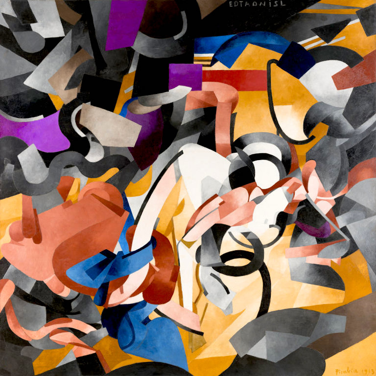

# 🎨 Neural Style Transfer with TensorFlow and VGG19

This project implements **Neural Style Transfer (NST)** using TensorFlow 2 and a pretrained **VGG19** network. The goal is to generate a new image that combines the **content of one image** with the **artistic style of another**.

---

## 📌 What is Neural Style Transfer?

Neural Style Transfer is a deep learning technique that separates and recombines **content** and **style** from two images using feature maps extracted from a convolutional neural network.

- **Content Image**: Defines the structure or semantics.
- **Style Image**: Defines texture, color, and patterns.
- **Generated Image**: Optimized to preserve content from the content image and style from the style image.

---

## 🧠 How It Works

NST uses a pretrained CNN (typically VGG19) to extract features from content and style images. These features are used to calculate losses that guide the generated image to match the desired output.

### Feature Extraction

- Extract intermediate feature maps from VGG19.
- Use `block5_conv2` for content representation.
- Use multiple layers (`block1_conv1`, ..., `block5_conv1`) for style representation.

---

## 🖼️ Visual Result

Here is how Neural Style Transfer blends the **content** and **style** images:

| Content Image                  | + Style Image                   | = Stylized Output              |
|-------------------------------|----------------------------------|-------------------------------|
|      |  |  |

---

## 🖼️ Visual Result

Here is how Neural Style Transfer blends the **content** and **style** images:

<p align="center">
  
  <span style="font-size: 24px; font-weight: bold;"> + </span>
  
  <span style="font-size: 24px; font-weight: bold;"> = </span>
  
</p>

> The output image maintains the spatial structure of the content image and adopts the colors, textures, and brushstrokes of the style image.


> The output preserves the structure of the content image and adopts the texture, brush strokes, and colors of the style image.

---

## 📐 Math Behind the Losses

### 📷 Content Loss

Measures the difference between the feature representations of the content image and the generated image.

```math
\LARGE \mathcal{L}_{content}(C, G) = \frac{1}{2} \sum_{i,j} (F_{ij}^C - F_{ij}^G)^2
```

Where:
- $`F_{ij}^C`$: Feature map of the content image at position \(i, j\)
- $`F_{ij}^G`$: Feature map of the generated image

---

### 🖌️ Style Loss

Measures the difference between the style (texture and pattern) of the style image and the generated image using **Gram matrices**.

#### 📊 Gram Matrix

The Gram matrix captures the correlation between feature maps:

```math
\LARGE G^l_{ij} = \sum_k F^l_{ik} F^l_{jk}
```

In code, this is implemented efficiently using:

```python
tf.linalg.einsum('bijc,bijd->bcd', input_tensor, input_tensor)
```

This computes the inner products between feature channels to form the Gram matrix.

#### Style Loss Formula

```math
\LARGE \mathcal{L}_{style}(S, G) = \sum_{l=1}^{L} \frac{1}{4N_l^2M_l^2} \sum_{i,j} (G^S_{ij} - G^G_{ij})^2
```

Where:
- $`L`$: Number of selected style layers
- $`N_l`$: Number of filters in layer $`l`$
- $`M_l`$: Spatial size of the feature map

---

### ⚖️ Total Loss

Combines content and style losses:

```math
\LARGE \mathcal{L}_{total} = \alpha \cdot \mathcal{L}_{content} + \beta \cdot \mathcal{L}_{style}
```

Where:
- $`\alpha`$: Weight for content loss (e.g., 1e4)
- $`\beta`$: Weight for style loss (e.g., 1e-2)

---

## 🛠️ Training Process

1. Initialize the generated image as a copy of the content image.
2. Extract target features from the content and style images.
3. Use `tf.GradientTape` to compute gradients of the total loss w.r.t. the generated image.
4. Update the image using an optimizer (e.g., Adam).
5. Clip pixel values between 0 and 1.
6. Repeat for multiple epochs.

---

## 🧱 Layers Used

| Type     | Layer Name       | Purpose                   |
|----------|------------------|---------------------------|
| Content  | `block5_conv2`    | Preserve structure        |
| Style    | `block1_conv1`    | Capture low-level textures |
|          | `block2_conv1`    |                           |
|          | `block3_conv1`    |                           |
|          | `block4_conv1`    |                           |
|          | `block5_conv1`    | Capture abstract style    |

---

---


## 📚 References

- Gatys et al. (2015), *“A Neural Algorithm of Artistic Style”* — https://arxiv.org/abs/1508.06576
- TensorFlow Style Transfer Tutorial — https://www.tensorflow.org/tutorials/generative/style_transfer

---

> “Art enables us to find ourselves and lose ourselves at the same time.” – Thomas Merton
